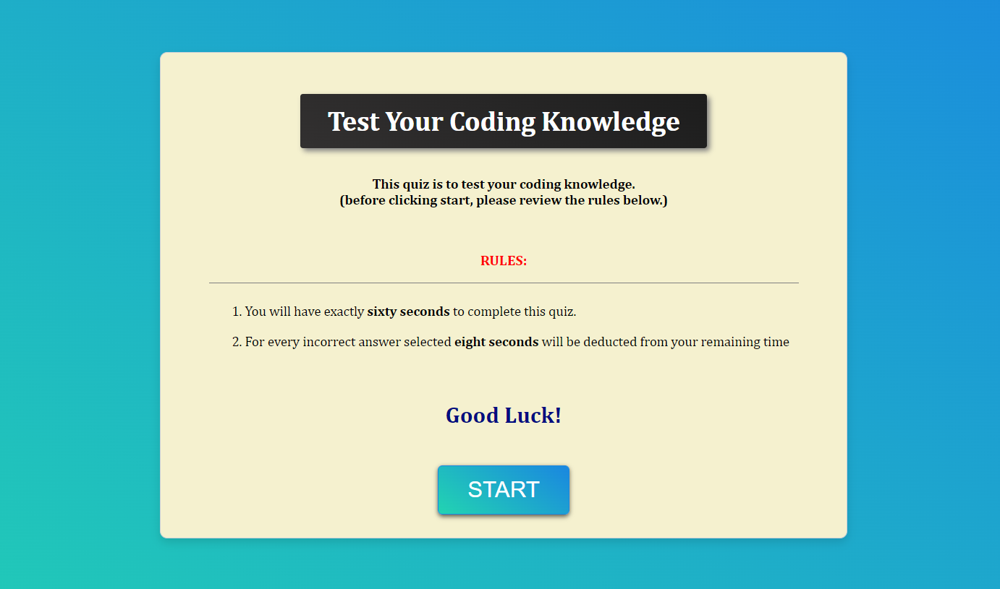
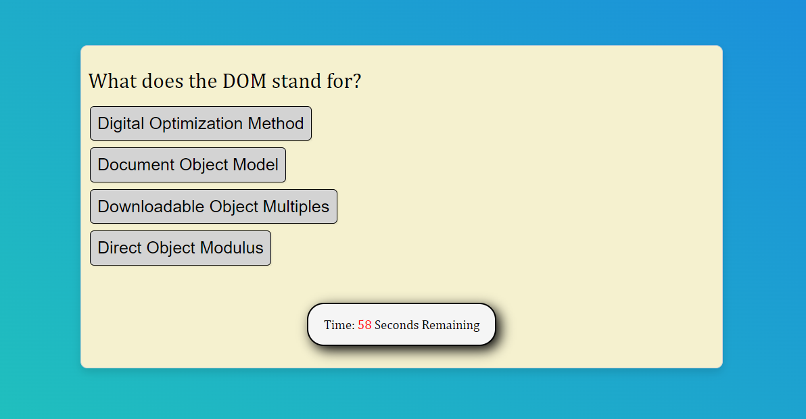
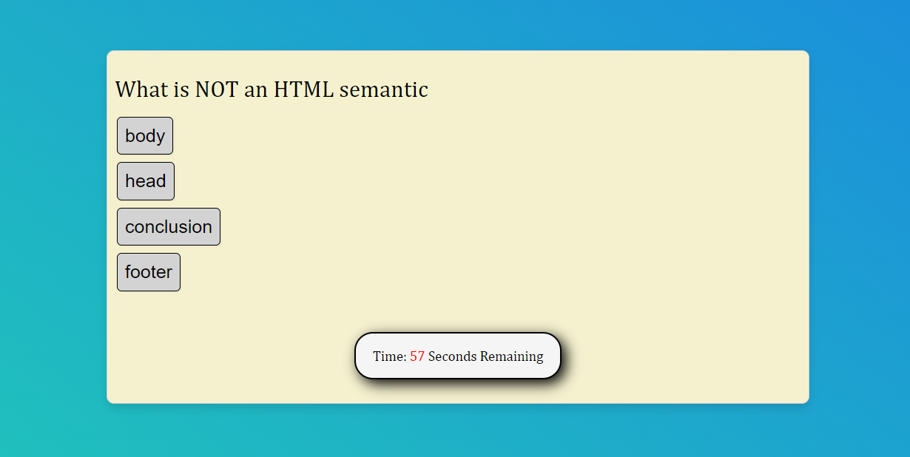
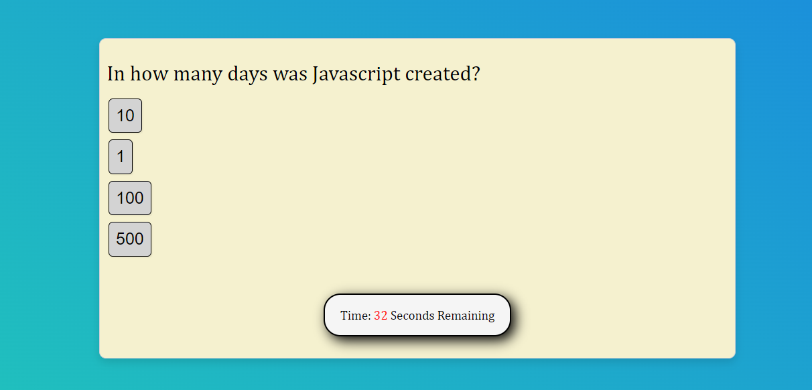
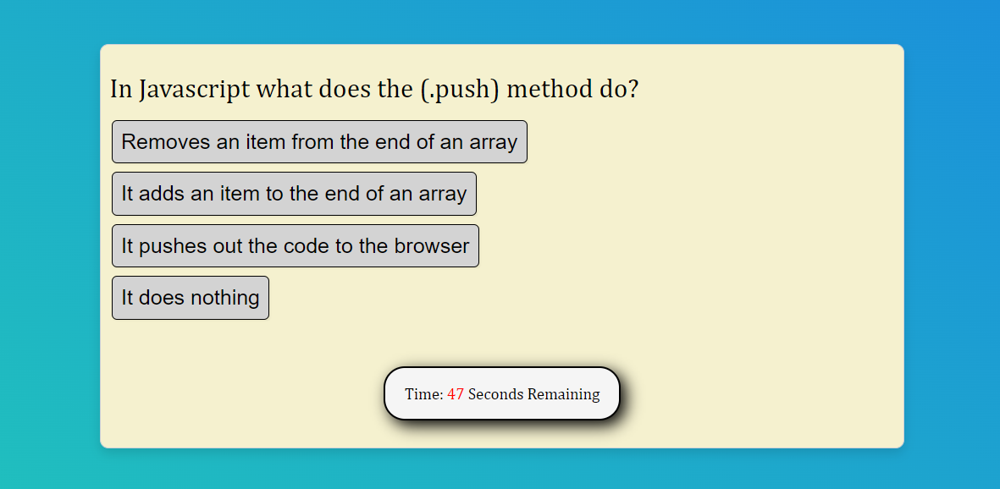
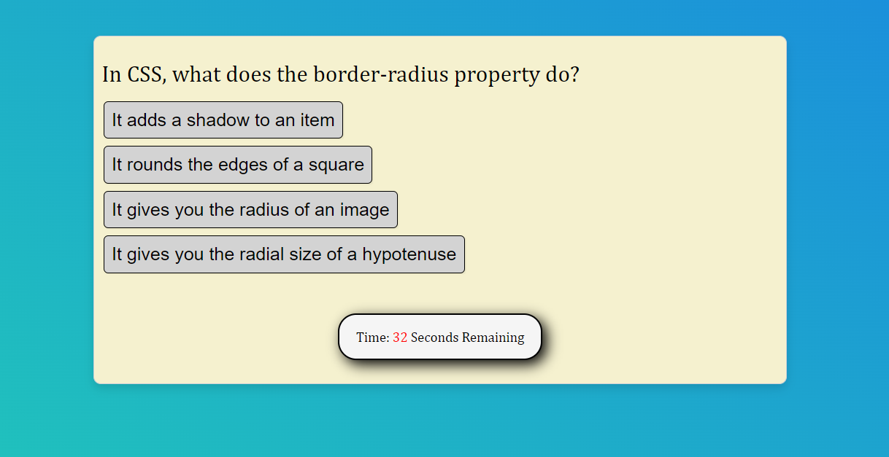
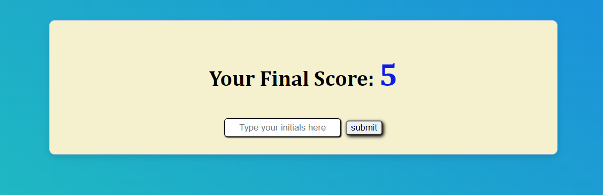
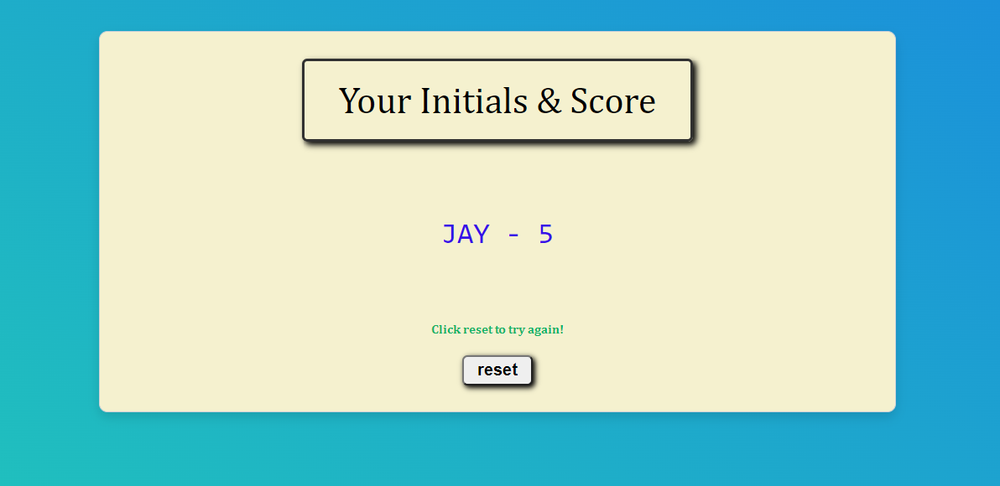

# My-Coding-Quiz

(Homework-4: Web API's: Code Quiz)

 

## Project Description: 

Even numbered week homework assignment. This weeks homework required us to create a coding quiz game from scratch using basic javascript only.

  

## Table of Contents:

 

- [Installation] (#installation)
- [Usage] (#usage)
- [Credits] (#credits)
- [License] (#license)
- [Badges] (#badges)
- [Features] (#features)
- [How] (#how to contribute)
- [Criteria] (#criteria's met)
- [HTML] (#html - details)
- [CSS] (#css - details)
- [URL] (#url (github repository))
- [URL] (#url (published webpage))

 

## Installation
 
** Go to <a href="https://jasonjayoo.github.io/my-coding-quiz/" target="_blank">My-Coding-Quiz</a> In order to view the My Coding Quiz Game Webpage.

 
 

## Usage: screenshots - (Highlighted Title(s) = a hyperlink to the direct image)

 
 

[Screenshot1](images/Screenshot1.png)  "Quiz Intro Screen + Start Button"

 

[Screenshot2](images/Screenshot2.png)  "Question 1 + Timer Initiated"

 

[Screenshot3](images/Screenshot3.png)  "Question 2"

 

[Screenshot4](images/Screenshot4.png)  "Question 3"

 

[Screenshot5](images/Screenshot5.png)  "Question 4"

 

[Screenshot6](images/Screenshot6.png)  "Question 5"

 

[Screenshot7](images/Screenshot7.png)  "Final Score Screen + Initials Input + Submit Button"

 

[Screenshot8](images/Screenshot8.png)  "Initials + Score Screen + Reset Button"

 
 

## Credits:

 

- My classmates: Tyler Welker & Jeoffrey Batangan were essential collaborators during the creation of this coding game! Thank you guys. 

 

- I would also like to thank my tutor Mr. Faran Navazi for help me with roadblocks I encountered along the way. 

 
 

## License:
 
    -  Non-applicable as of this time
 
 

## Badges:
 
    - UCI Full Stack Bootcamp
 
 

## Features:
 
    - A coding quiz game that include a total of 5 questions.
    - Once the player initiates the game by clicking the start button in the first screen the game beings.
    - The timer begins to countdown from 60 seconds
    - For every correct answer the player selects the button turns green upon click and the the player is given 1 point.
    - For every incorrect answer the player selects the button turns red upon click and the players available time is reduced by 8 seconds from the remaining time. 
    - If the timer goes down to zero the game will be over and the total points tallied in the score screen.
    - The score screen will show how many points the players earned.
    - The score screen also has an input box to type in their initials. Up to 3 Upper or Lowercase Alphabet Characters or Blanks if they wish to remain anonymous are allowed. 
    - Once the player is finished with the initials box they can click the submit button.
    - Once the submit button is clicked the final score and initials screen will display their score. They can click the reset button to try again. Their previous scores will be kept on file in the local storage. 

 
 

## How to Contribute:
 
    - My github repository is publically viewable. If you would to contribute to the webpage please email me at jasonjayoo@outlook.com with the request and I will add you as a contributor on the repo. 
 
 

## Tests:
 
    - Try the quiz game out yourself and see how well you can do!. 
     
    - You can test out the webpage on vsc or directly in the inspect window of your browser. 

 
 

## Criteria's met: 

 

1. The Coding Quiz meets the criteria's listed in the assignment.
 
    - A clickable Start Button which starts the quiz game needs to be created.
     
    - A timer starts once the game begins and the questions are presented.
     
    - When an answer has been selected the next question is displayed on the screen.
     
    - If the player selects an incorrect answer the remaining time is reduced by 8 seconds and the next question is displayed.
     
    - When all the questions have been answered or the time runs out the game ends.
     
    - When the game ends the player is taken to the score screen where their score is shown. They can enter their initials in the initials input box and click submit.
     
    - Once they click submit the player will be taken to the Final score and initials screen where they can see their initials and score rendered on the page.
     
    - They player can then click the reset button to try again. Their scores from previous attempts will be stored in the local storage and will continue to render after each game. 

 
 

## HTML - Details:

 

1. The HTMl includes within the body element: the main element with several divs which holds the start screen text and start button, questions txt with the answers as buttons, the quiz timer, final score texts and submit button, and the footer which holds in the last screen with the reset button.
 
2. Unique and custom made questions and answers were created by yours truy for this quiz game.
 
3. The input element within the end-screen has the "Your Final Score" with the score in located in a span. The input element has a onkeypress which limits allowable keys to only the upper and lowercase alphabets.
 
 

## CSS - Details:

 

1. The CSS was created to best house and style all the texts, timer, and buttons. Pseudo code for hover and active was used for all the buttons as well. 
 
2. Media Queries was also included to adjust to several different screen sizes (not all but many).

 
 

## JS - Details:

 

1. Variables for the all the div classes and ids that were to be affect was created.
 
2. QuerySelector and to the lesser extent getElementById were used to pull the classes and id within the html.
 
3. The correct answers were directly linked to the specially titled id names of the answers buttons.
 
4. The variable for the amount of time we set to (secondsLeft) which was a total of 60 seconds.
 
5. The first function I coded was the startQuiz which has the timerInterval Function built into it (object method).
 
6. answers1Div - answers5Div are individual event-listener functions which render only the select question(s) in sequential order. While hiding all other screens. The correct button is targeted to give a point of 1. The penalty for choosing anything but the correct answer (aka incorrect answer) the secondsLeft is reduced by 8. Whenever an answer button is clicked (correct or incorrect) the current answers#Div is hidden and the next answers#Div function is rendered. 
 
7. answers5Div once a button has been clicked renders the submitBtn event-listener function which displays the highscores var where the players score will be rendered and initials var where the player can type in their initials. Along with the submit button itself that once clicked will render the Players Initials and their Score in the Initials and Final Score Screen. Which are then stored in the local storage via the [window.localStorage.setItem("highscores", JSON.stringify(highscores));
showAllScores();]. The highscores will received the players score and initials via the newScore being pushed inot the highscores var and the highscores var being stringified via JSON.Stringify.
 
8. The showAllScores function will call the highscores var that has the players initials and score which is stored in the local storage via the window.localstorage.getItem. A new "p" element created within the var listItem is created and appended to the tableEl which is set as all-scores id in the html. The listItem var will render the textcontent as the player "person" .initials and score. 
 
9. Lastly, a reset button is in the Initials and Final Score screen that once clicked, allows the user to replay the game. All scores are stored in the local storage and tallied up and rendered along with the current score. 

 
 

## URL (Github Repository):

Click [here](https://github.com/jasonjayoo/my-coding-quiz) to go to the My-Coding-Quiz Github Repository

 

## URL (Published Webpage):

<a href="https://jasonjayoo.github.io/my-coding-quiz/" target="_blank">My-Coding-Quiz</a>